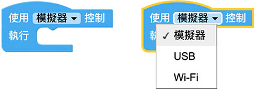
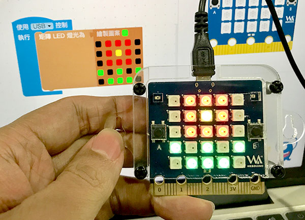

# 開發板

提供了三種控制開發板的方式，分別是「模擬器」、「USB」和「Wi-Fi」，模擬器能夠在沒有硬體的狀況下進行學習，USB 可以在沒有網路的情況下，透過 USB 連線操控，而 Wi-Fi 則可以進行無線遠端遙控，透過三種不同操控方式的互相搭配，不論各種情境都能隨心所欲的控制。

## 使用方式

下拉選單選擇「模擬器」，表示*使用右側的「虛擬開發板」*，開發板積木裡所有控制的元件，都會指向右側的虛擬開發板，例如繪製一個圖案，執行後，虛擬開發板就會顯示圖形。

下拉選單選擇「USB」，表示*使用「USB 線」連接「硬體開發板」*，**必須使用「安裝版編輯器」操作**，例如繪製一個圖案，執行後，透過 USB 連接的開發板就會顯示圖形。

> 安裝版編輯器請參考：[編輯器 ( 安裝版工具列 )](../info/toolbar.html)

下拉選單選擇「Wi-Fi」，表示*使用「Wi-Fi」連接「硬體開發板」*，也就是透過**每塊開發板的 Device ID 進行控制**，只要知道 Device ID，不論開發板身在何處，都能遠距操控。( 使用行動電源供電，會更有「遠距操控」或「無線操控」的感受 )

> 開發板 Device ID 請參考：[硬體開發板 ( 初始化設定 )](../info/setup.html)

## 控制多塊開發板

編輯器可*同時控制多塊開發板*，只需要在編輯畫面裡放入開發板，指定開發板的操控方式，執行後就會看到所有開發板同時發生變化，下圖的例子，在同一個編輯畫面裡，讓一塊模擬器開發板和兩塊 Wi-Fi 開發板，同時呈現花朵圖案。

> 多塊開發板*最多包含一塊「模擬器」開發板和一塊「USB」開發板，「Wi-Fi」開發板則沒有數量限制*。

在控制多塊開發板的情況下，**不支援使用函式控制**，要特別注意！

