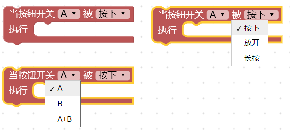
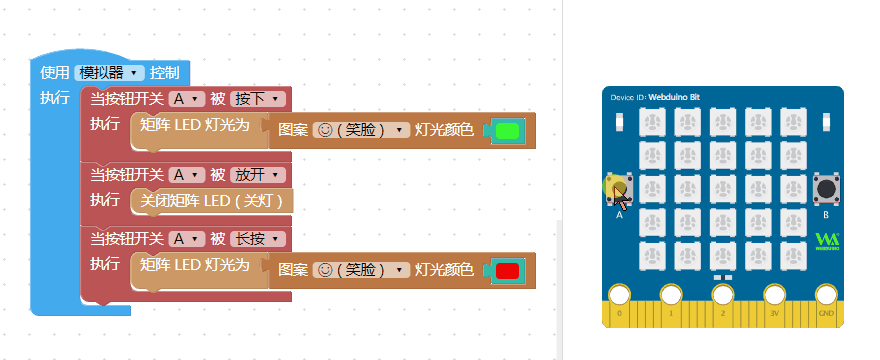

- | 测试日期      | 测试环境          | 硬件版本  | 固件版本           | 软件版本 | 测试人员      |测试结果 |
  | ------------- | ----------------- | --------- | ------------------ | -------- | ------------- |------------- |
  | 2019年8月22日 |  Windwos7 &Windwos10  |  1.4 | 7NJfWecLminDsnEtpD | 1.2.5   | 陈渊&徐光发 |通过 |

## 按钮开关

在开发板正面的左右两侧，有两颗按钮开关，通过使用这两个开关，可以打造真实的游戏遥控器或智能家居控制的应用，更符合物联网的使用场景。

### 按钮开关积木说明

按钮开关积木可以指定「按下、放开、长按」三种开关行为，三种行为可分别套用到 A、B 或 A 和 B 同时操作。 ( 长按的定义为持续按下一秒 )

> *使用按钮开关积木必须搭配「开发板」积木*，选择模拟器，执行后就可以使用鼠标点击模拟器上的按键，选择 USB，执行后会通过 USB 连接方式控制实体开发板，选择 Wi-Fi 则可通过Wi-Fi 指定 Device ID 操控开发板。

### 按下开关改变 LED 矩阵图案

在编辑画面放入按下A、按下B 和按下A+B 的积木，接着分别在各自的区块内放入LED 矩阵显示图形的积木，执行后，如果是使用模拟器，就可以用滑鼠点击 A 、B 或 A+B 按钮查看变化效果，如果是使用实体开发板，则可以直接用手指按压开关。

> 模拟器里的 A+B 按钮开关，只有在编辑画面有 A+B 按钮开关的积木时才会出现。

### 按下、放开和长按

通过开关的按下、放开和长按三种行为，就能做出「按下时有图案，变成长按后图案会变色，最后放开开关就会关灯」的范例，执行后，如果是使用模拟器，就可以用鼠标点击 A 按钮查看变化效果，如果是使用实体开发板，则可以直接用手指按压开关。

