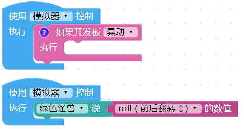
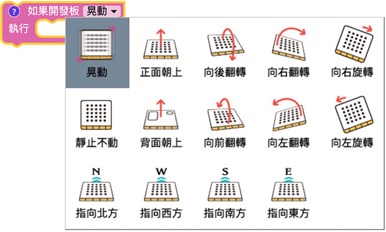
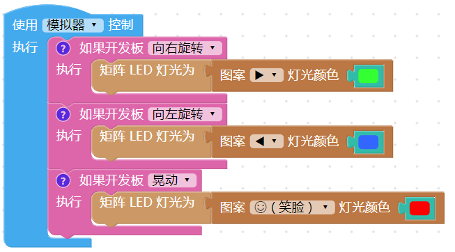
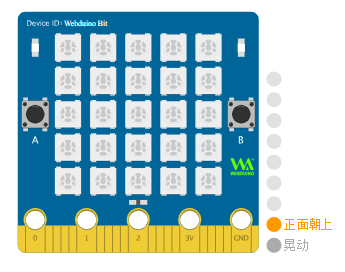
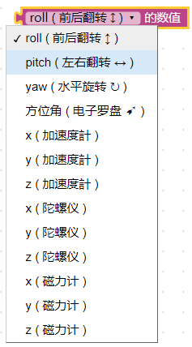

 <ul>
<li><table>
<thead>
<tr class="header">
<th>测试日期</th>
<th>测试环境</th>
<th>硬件版本</th>
<th>固件版本</th>
<th>软件版本</th>
<th>测试人员</th>
<th>测试结果</th>
</tr>
</thead>
<tbody>
<tr class="odd">
<td>2019年8月24日</td>
<td>Windwos10 &amp; Windwos7</td>
<td>1.4</td>
<td>7NJfWecLminDsnEtpD</td>
<td>1.2.5</td>
<td>陈渊 &amp;徐光发</td>
<td>小问题：部分积木展开仍有繁体字</td>
</tr>
</tbody>
</table></li>
</ul>

## 运动 & 姿态

开发板内有一个MPU-9250 九轴传感器，除了可以检测空间内的加速度与旋转，用作体感检测、体感游戏...等应用之外，更能通过磁力计的辅助检测，实现检测姿态角度、指南针...等应用。

### 九轴体感检测积木清单

九轴体感检测积木有两种，一种可检测指定的动作，另一种则可取得九轴感测器的数值。

> *九轴体感检测积木必须搭配「开发板」积木*，选择模拟器时无法取得九轴体感数值，但可以通过指定动作的按钮模拟对应动作，选择USB，执行后会通过 USB 连接方式控制实体开发板，选择 Wi-Fi 则可通过 Wi-Fi 指定 Device ID 操控。

### 检测指定的动作

「检测指定的动作」积木能检测静止、晃动、正面朝上、背面朝上、向后向前翻转、向左向右翻转、向左向右旋转、指向东西南北...等14 种开发板动作。

下图的例子，开发板往右旋转会出现向右的绿色箭头，开发板往左旋转会出现向左的蓝色箭头，如果开发板晃动则会出现红色笑脸。

如果是使用模拟器，执行后再开发板的右侧会出现一排按钮，并用文字提示正在检测的指定动作，以上图的例子而言，表示正在检测向右旋转、向左旋转以及晃动。

### 取得九轴传感器的数值

「取得九轴传感器的数值」积木能够取得加速度、磁力计、陀螺仪以及水平旋转、前后左右翻转的数值。 ( *模拟器无法模拟此块积木，必须使用实体开发板* )

#### 加速度计

加速度计主要
